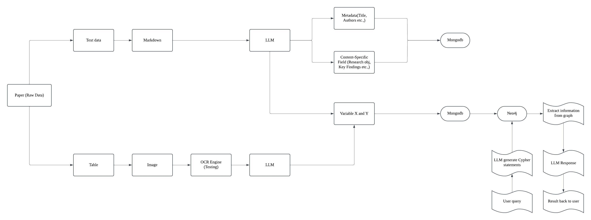

# AI4ExtractInfo

This repository is designed to extract specific details from research papers by leveraging AI. Simply provide a list of questions, and the system will extract the desired information.

---

## Features
1. Extracts research paper content from PDFs and converts it into Markdown.
2. Utilizes large language models (LLMs) to:
   - Answer specific questions about the research paper.
   - Identify Independent Variables (X) and Dependent Variables (Y).
3. Inserts variables into a graph database with relationships represented as edges ([Variable1 -> Y, edge as X]).
4. Allows users to query the graph easily, e.g., "[List all X nodes for **Y VARIABLES**]."

## Workflow


---

## Prerequisites
1. Install [Docker](https://docs.docker.com/engine/install/).
2. Deploy Neo4j using Docker ([Neo4j Docker Setup](https://neo4j.com/docs/operations-manual/current/docker/introduction/)).
3. Install [Anaconda](https://www.anaconda.com/products/distribution).

---

## Installation
1. Create a new Conda environment:
   ```bash
   conda create -n ai4extractinfo python=3.11
   ```
2. Install [MinerU](https://github.com/opendatalab/MinerU):
   - Follow the instructions in the MinerU repository to install the MinerU parser.
3. Install the required Python packages:
   ```bash
   pip install -r requirements.txt
   ```

---

## Usage
Follow these steps to run the code:

1. **Parse data from PDFs**  
   Extract content from research papers using MinerU:
   ```bash
   python parser/minerUparser.py
   ```

2. **Extract information using LLM**  
   Process the Markdown files to extract variables and answers to specific questions:
   ```bash
   python llm/llm_extract.py
   ```

3. **Insert parsed data into MongoDB**  
   Store the extracted data in a MongoDB database:
   ```bash
   python database/mongodb.py
   ```

4. **Insert X and Y into a graph**  
   Add variables to a Neo4j graph database:
   ```bash
   python database/neo4jdb.py
   ```

5. **Query the graph**  
   Retrieve insights from the graph database:
   ```bash
   python kg/g_rag.py
   ```

---

## Example Query
Retrieve all independent variables (X) associated with a dependent variable (Y):
```plaintext
[List all X nodes for **Y VARIABLES**]
```

---

## Contributions
Contributions, issues, and feature requests are welcome! Feel free to fork this repository and submit a pull request.

---

## License
This project is licensed under [MIT License](LICENSE).

---

## Acknowledgments
- Thanks to [MinerU](https://github.com/opendatalab/MinerU) for providing an excellent PDF parsing solution.
- Neo4j and MongoDB for their robust database solutions.
